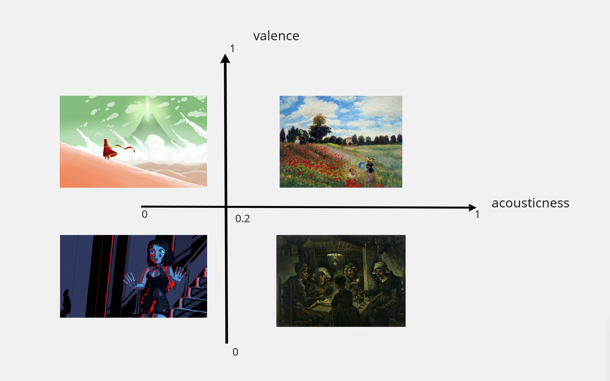
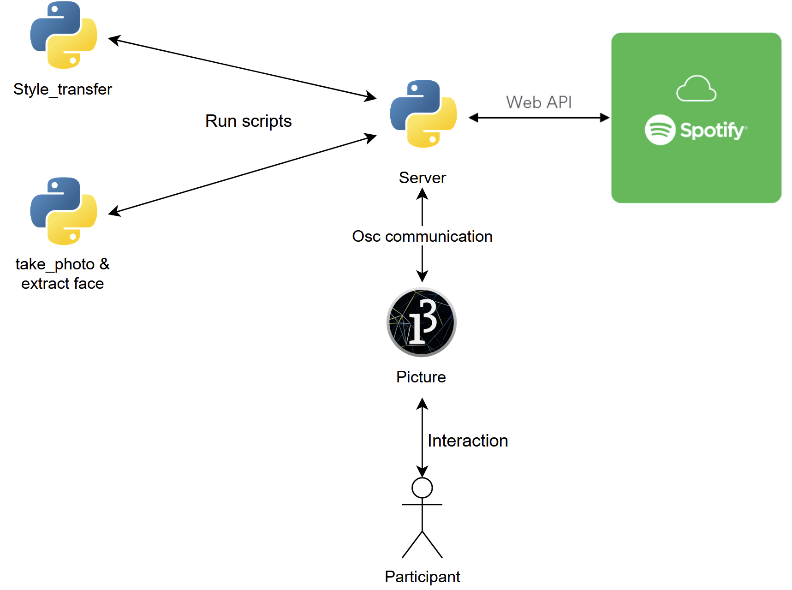
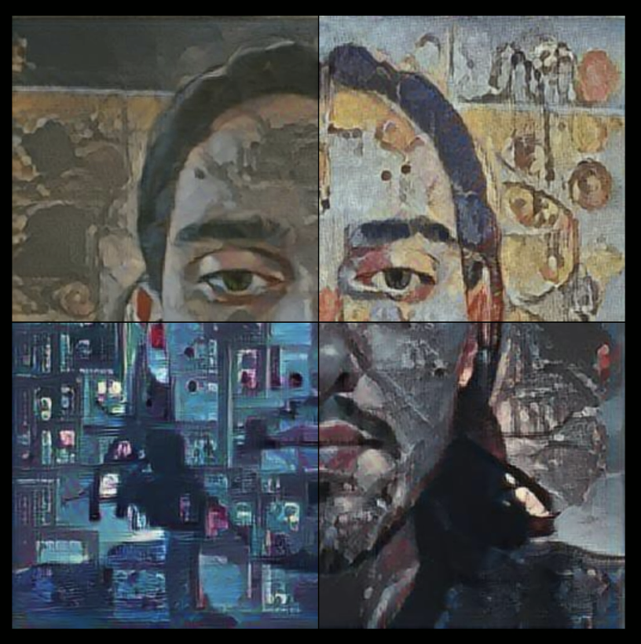

# Collective Dynamic Portrait - Work in progress...

## Abstract:

The goal of this project is to represent the collectivity of personalities of all the participants at this exposition. It will become an interactive portrait of all of them with the aim of collecting diversities in a whole.

The experience starts with a blank screen with no sound being produced. 
The first person will move in front of the empty portrait  and, using his smartphone, will be asked to scan a QR code with his smartphone. The QR code lead the user to a web page in which he/she will be asked to given the authorization to user his/her Spotify data. After this process also his face will be scanned taken a photo. 

Consequently, the screen will start showing a portion of the person’s face in the center, processed with a style based on his Spotify account. 
The style used in the style transfer process will be chosen accordingly to the acousticness and the valence values of the top track associated to the user's Spotify account.

In particular:
* The higher the acousticness, the more classic will be the style applied and viceversa the lower the acousticness, the more modern will be the style applied.
* The higher the valence, the warmer the colour present in the style and the lower the valence, the darker the colour used in the style.

In the meanwhile, also a sound will be produced, changing some characteristics (e.g. timbra) according to the data obtained from Spotify.

The following participants will repeat the same process, but after each iteration they will see a more complete and complex painting and musical background, since all the contributions will sum up.

Each participant will also be able to move his hand in front of the painting in order to alter the audio/video result, getting closer or further to the contribution of each person (the background of the painting will work like an abstract plane where all the contributions are distributed).

## Demo:

The first demo developed works in a local way with a server Python which communicates with the Processing application using the OSC protocol, as shown in the workflow's picture. Currently the part regarding sound and Supercollider has not already been implemented.

Instead of using the QR code, the Spotify's token is asked directly to the user, then the values of acousticness and valence are computed and sent back to the  Processing application. 
Consequently, the user will press enter in order to communicate to Python that he/she is ready to take a photo. Once the Python script shoots the picture, there will be an exchange of messages between Python and Processing to apply the right style transfer (according to acousticness and valence previously computed).
Finally, when the style transfer is applied the final modified picture is saved and a portion of it will be shown in Processing.
This process can be repeated everytime a new user wants to partecipate and contribute to the final artwork.

Group members: 
* Francesco Zumerle 10801101
* Annafelicia Renzi 10801270
* Elisa Castelli 10615041
* Andres Gonzales Paul 10736712
