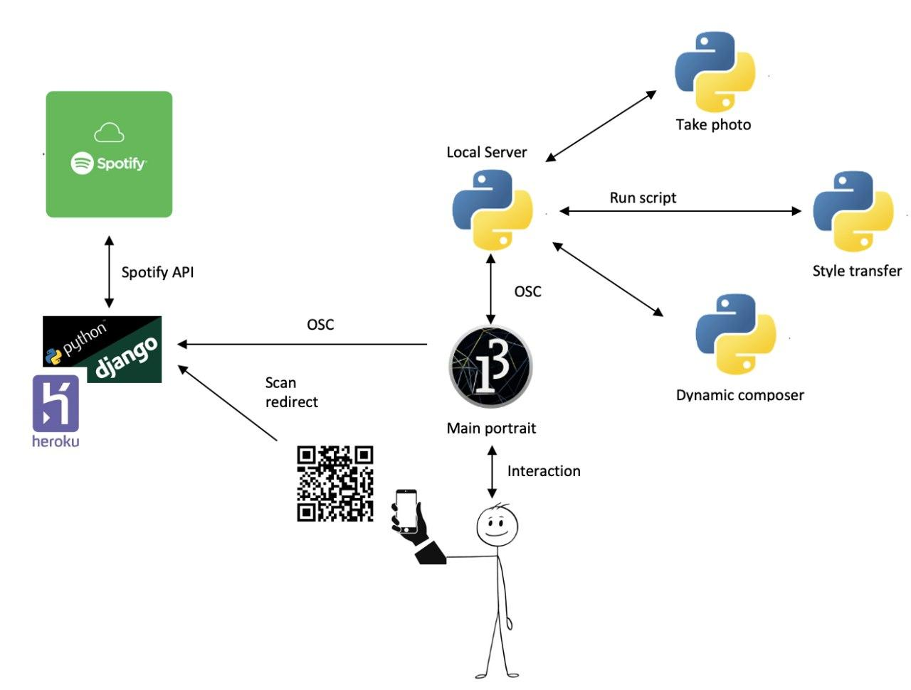

# Collective Dynamic Portrait 

## Abstract:

The goal of this project is to represent the collectivity of personalities of all the participants at this exposition. It will become an interactive portrait of all of them with the aim of collecting diversities in a whole.

The experience starts with a black screen with an empty portrait and no sound being produced. 
The first person will move in front of the empty portrait  and, using his smartphone, will be asked to scan a QR code with his smartphone. The QR code lead the user to a web page in which he/she will be asked to given the authorization to user his/her Spotify data. After this process also his face will be scanned taken a photo. 

Consequently, the screen will start showing a portion of the person’s face in the center, processed with a style based on his Spotify account's data. 
The style used in the style transfer process will be chosen according to acousticness, valence, energy and speechiness values of the top track associated to the user's Spotify account.

In particular:
* The higher the acousticness, the more classic will be the style applied and viceversa the lower the acousticness, the more modern will be the style applied.
* The higher the valence, the warmer the colour present in the style and the lower the valence, the darker the colour used in the style.
* The higher the speechiness the more concrete will be the subject of the portait used to make the style transfer. The lower the speechiness, the more abstract the portait used to make the style transfer.
* The higher the energy the bolder will be the edges in the styke applied and viceversa

In the meanwhile, also a sound will be produced, according to the data obtained from Spotify. Each person determines a different type of instrument used in the sound reproduced in loop. The instrument type is determined directly from the Spotify's audio features and each time an instrument is chosen we used grammars to build a loop. Each instrument is finally mixed with the others composing a unique sound that will be reproduced.

The following participants will repeat the same process, but after each iteration they will see a more complete and complex painting and musical background, since all the contributions will sum up.

## Workflow:
 

Participants can interact with the portrait following some rules: first of all, scanning the QR code they authorize us to use their Spotify account's data. Then they can interact with the portrait pressing enter (for example for taking the photo and launching the style transfer).

Scanning the QR code, the user is lead to a web site in which, using Spotify APIs, we ask him the authorization to use his top song's audio features. These audio features are saved on our database.
Then the portrait on the Processing application, after the Spotify's values are recieved using OSC messages, starts to change asking the user to take a photo and launching the style transfer script. The scripts for taking the photo, applying the style transfer and composing the sound background, are accessible on a Python local server called from the Processing application.

The user will press enter in order to communicate to Python that he/she is ready to take a photo. Once the Python script shoots the picture, there will be an exchange of messages between Python and Processing to apply the right style transfer.
Finally, when the style transfer is applied the final modified picture is saved and a portion of it will be shown in Processing. Moreover also the song composed will be reproduced.
This process can be repeated everytime a new user wants to partecipate and contribute to the final artwork.

Group members: 
* Francesco Zumerle 10801101
* Annafelicia Renzi 10801270
* Elisa Castelli 10615041
* Andres Gonzales Paul 10736712
